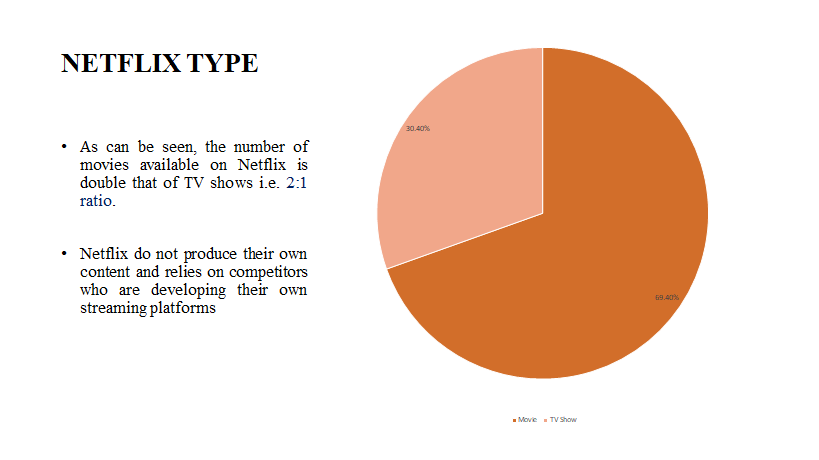
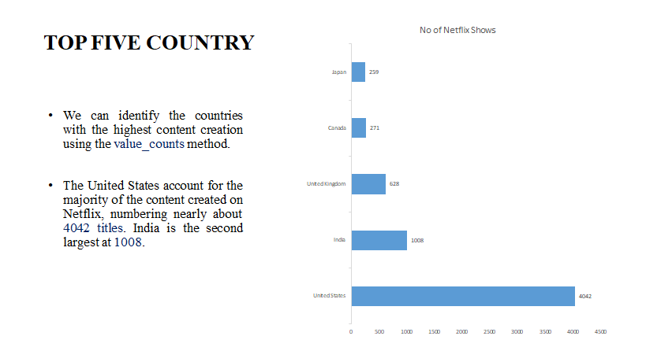
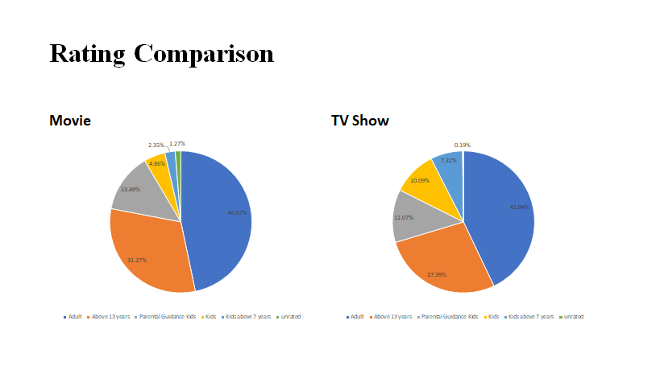
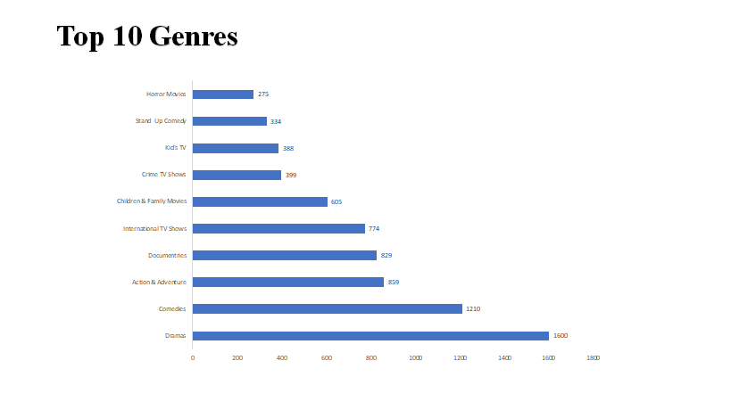
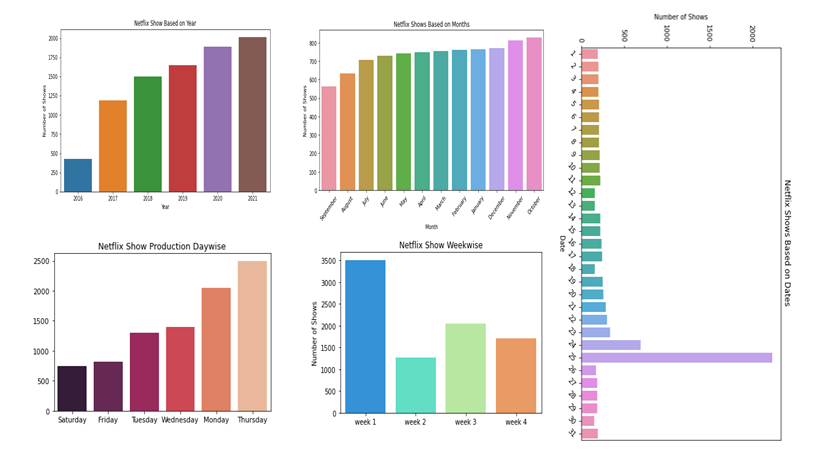

## Netflix Show Classifier App

### Aim: 
To provide end users with recommendations based on the personalized TV shows and Movies content.
### Objectives:
- Recommendation based on type of content produced by Netflix data daily.
- Popularity of content based on type, genres, country etc.
- Help in production planning for the people who is producing the content at the backend.
- Finally, we can do the business insights and deliver it to the audience.
### Methodology:
- **Business understanding:** Before even producing the contents we should understand the purpose of the business people and according to their profit we should take further actions.
- **Analytical approach:** Here comes the part of the Data Analyst people who work in the data to draw out meaningful insights and help the netflix organization to grow their business in terms of revenue.
- **Data requirements:** It is a very vital role of a data analyst to check for the requirements of the data. What actually they need and what not?
- **Data collection:** Collecting data is also a important part of the same as we need structred data and with minimal amount of anomolies.
- **Data understanding:** Exploratory Data Analysis (EDA) is done on the given data to see for the features that are most important and also check for errors.
- **Data preparation:** After cleaning process we prepare the data for model development.
- **Model Development:** In this vary stage we undergo the use of different machine learning algorithm to check which algorithm best fits the model and which does not.
- **Evaluation:** After model development we check the performance metrics and do validation and also checks for the accuracy which produces more accurate results.
- **Deployment:** Once the evaluation is done we finally deploy the machine model on Heroku.
- **Feedback:** We also take customer reviews based on the app that recommends netflix content and if they are not happy with the application then we further try to do more analysis on which feature they want to add on on the existing application.
### Data Visualization:
#### 1. Which content type is most popular?

#### 2. Which country produced more content overall?

#### 3. Side-by-side comparison of netflix content based on rating

Differentiating the ratings between Movies and TV shows shows us that for the people of age group below 13 years prefer TV shows more compared to the age group above 13 years who loves watching movies.
#### 4. Which country producing more content based on ratings and categorized by type?

Differentiating the ratings between Movies and TV shows shows a fairly 2:1 ratio across the categories.
#### 5. Top 10 Genres on netflix produced

The majority of netflix content are produced by genres dramas and comedies.
#### 6. Overall Analysis

The main insight that we can draw from the above graph is that:
- Year 2021 is most produced.
- October is the highest month on the amount of netflix content watched online.
- Mostly, people all over the world love watching netflix on Thusrdays.
- 24,25 is the most popular dates that people love streaming.

### Tools & Technology used:
- Python
- Jupyter Notebook
- Streamlit
- Heroku
- Tableau
- Python libraries: pandas, seaborn, plotly and matplotlib
### Conclusion:
We have drawn many interesting inferences from the dataset Netflix titles; here’s a summary of the few of them:

- The most content type on Netflix is movies.

- The popular streaming platform started gaining traction after 2014. Since then, the amount of content added has been increasing significantly.

- The country by the amount of the produces content is the United States.

- The most popular year of producing most Netflix content is 2021.

- Drama is a genre that is mostly in Netflix.

- The largest count of Netflix content is made with a “TV-14” rating.
### Future work:
Future analysis of this data can include :

- Analyzing the content available in different countries.

- Identifying insight based on Directors, Actors and Actresses using network analysis.

- Popularity of TV shows and Movies insight analysis.

